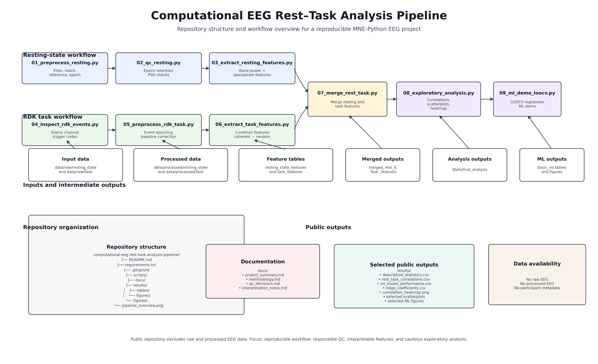

Here is a **clean, hiring-optimized rewrite** of your README. I reduced redundancy, improved narrative flow, and strengthened “research + portfolio impact” positioning while keeping your scientific rigor intact.

---

# MNE EEG Rest–Task Analysis Pipeline


A reproducible EEG analysis pipeline for resting-state and RDK visual motion task data using **MNE-Python**, spectral feature extraction, aperiodic (1/f) parameterization via `specparam`, and exploratory statistical + machine-learning workflows.



---

## Overview

This project implements an end-to-end computational EEG workflow, covering:

* Resting-state EEG preprocessing and quality control
* RDK (random-dot kinematogram) task epoching and condition handling
* Spectral and band-power feature extraction
* Aperiodic (1/f) parameterization using `specparam`
* Rest–task feature integration at subject level
* Exploratory statistics and visualization
* Leave-one-subject-out machine-learning demonstration

The focus is on **reproducible computational neuroscience workflow design**, not confirmatory inference.

---

## Research Aim

To explore whether **resting-state EEG features** relate to **task-related modulation** during visual motion processing.

**Core question:**

> Do resting spectral and aperiodic signatures predict differences in RDK task-related spectral modulation (coherent vs random motion)?

---

## Data Availability

Raw and processed EEG data are not included due to participant confidentiality and institutional data-sharing restrictions.

This repository therefore emphasizes:

* analysis pipeline design
* feature extraction strategy
* QC decisions
* reproducible code structure
* selected derived outputs

---

## Pipeline Summary

```
Raw EEG
→ preprocessing
→ quality control
→ feature extraction
→ rest–task integration
→ exploratory statistics
→ ML demonstration
```

---

## Repository Structure

```text
mne-eeg-rest-task-pipeline/
├── scripts/
│   ├── 01_preprocess_resting.py
│   ├── 02_qc_resting.py
│   ├── 03_extract_resting_features.py
│   ├── 04_inspect_rdk_events.py
│   ├── 05_preprocess_rdk_task.py
│   ├── 06_extract_task_features.py
│   ├── 07_merge_rest_task.py
│   ├── 08_exploratory_analysis.py
│   ├── 09_ml_demo_loocv.py
│   └── 10_make_pipeline_overview.py
│
├── docs/
│   ├── methodology.md
│   ├── qc_decisions.md
│   └── interpretation_notes.md
│
├── results/
│   └── figures/
│
└── figures/
    └── pipeline_overview.png
```

---

## Methods Overview

### Resting-State EEG

* Band-pass: 1–40 Hz
* Notch filtering: 50/100 Hz
* ICA-based artifact handling (where applicable)
* 2-second epoching
* Average reference

### RDK Task EEG

* Event-based epoching from Status channel
* Conditions:

  * coherent motion
  * random motion
* Baseline correction applied
* Condition-level spectral analysis

### Feature Extraction

* Band power: delta, theta, alpha, beta, gamma
* Relative power measures
* Aperiodic offset and exponent (`specparam`)
* Alpha peak features
* ROI-based aggregation (posterior regions)

---

## Key Outputs

The pipeline generates:

* Resting-state spectral profiles (PSD)
* Aperiodic (1/f) parameters
* Task condition contrasts (coherent vs random)
* Rest–task feature dataset (subject-level)
* Correlation matrices and scatterplots
* ML regression models (LOOCV)

---

## Machine Learning (Exploratory)

A small-scale ML workflow was implemented using resting-state EEG features to predict task-related spectral modulation.

Models:

* Linear regression
* Ridge regression
* Random forest regression

Validation:

* Leave-one-subject-out cross-validation

**Note:** Results are exploratory due to limited sample size (N = 6) and are not intended as predictive validation.

---

## Key Findings (Exploratory)

* Resting-state alpha and aperiodic features showed relationships with task-related spectral modulation
* Posterior EEG features were most informative for rest–task associations
* Predictive ML performance was limited, as expected given small sample size

These results are **hypothesis-generating only**.

---

## Quality Control

* One resting-state participant excluded due to insufficient clean epochs
* Several task participants excluded due to low-quality epoch retention
* Final matched sample: **N = 6**

Final included subjects:
S10, S11, S12, S13, S15, S18

---

## How to Run

```bash
pip install -r requirements.txt
```

Then execute:

```bash
python scripts/01_preprocess_resting.py
python scripts/02_qc_resting.py
python scripts/03_extract_resting_features.py
python scripts/04_inspect_rdk_events.py
python scripts/05_preprocess_rdk_task.py
python scripts/06_extract_task_features.py
python scripts/07_merge_rest_task.py
python scripts/08_exploratory_analysis.py
python scripts/09_ml_demo_loocv.py
```

---

## Skills Demonstrated

* EEG preprocessing with MNE-Python
* Resting-state and task EEG analysis
* Event-based epoching (RDK paradigm)
* Spectral feature engineering
* Aperiodic EEG modeling (`specparam`)
* ROI-based analysis
* Quality-control decision-making
* Data integration (rest–task linkage)
* Exploratory statistics
* Machine-learning workflow design
* Reproducible research structuring

---

## Limitations

* Small sample size (N = 6)
* Data not publicly shareable
* Exploratory, non-confirmatory analyses
* ML results are demonstration-level
* Task data variability across participants

---

## Summary

This project demonstrates a complete, reproducible EEG analysis pipeline integrating resting-state and task-based EEG using modern computational neuroscience tools. The emphasis is on workflow design, feature engineering, and transparent analysis structure rather than confirmatory inference.


---

## Disclaimer

This repository is intended as a computational neuroscience portfolio and methodological demonstration project. Due to data ownership, participant confidentiality restrictions, and the small final sample size, the repository emphasizes reproducible workflow design rather than confirmatory scientific inference.
```
