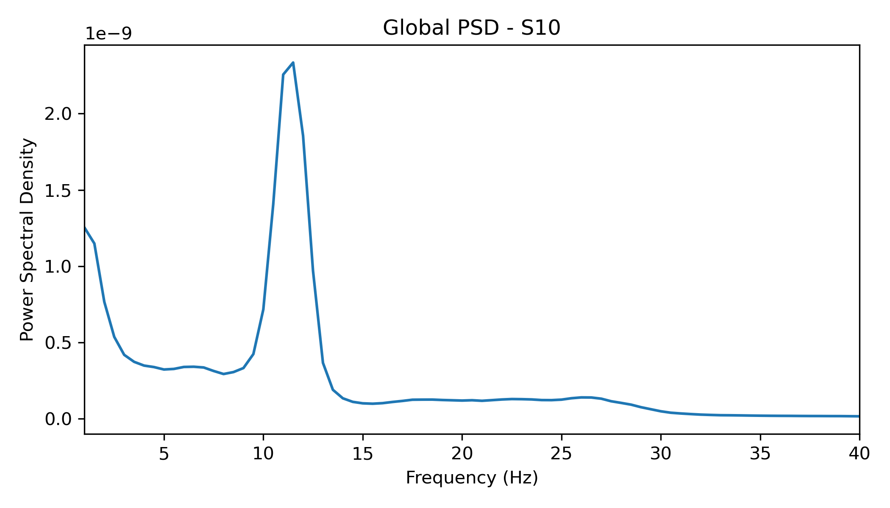
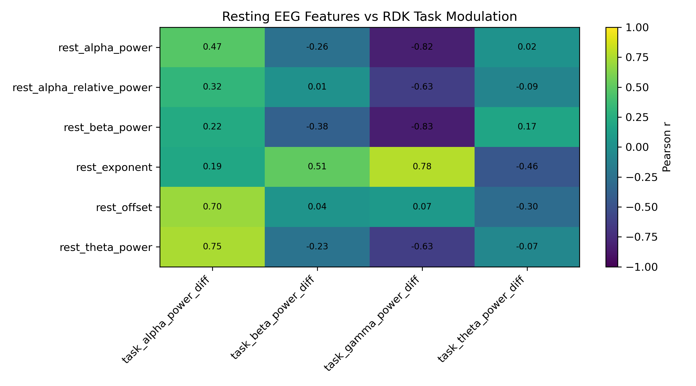
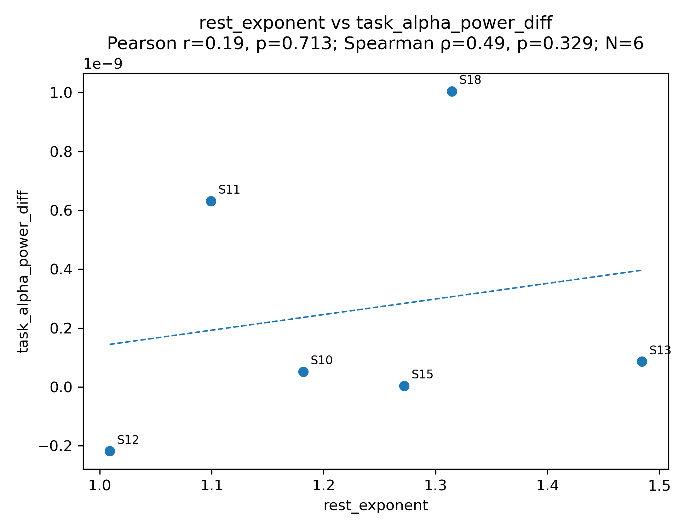
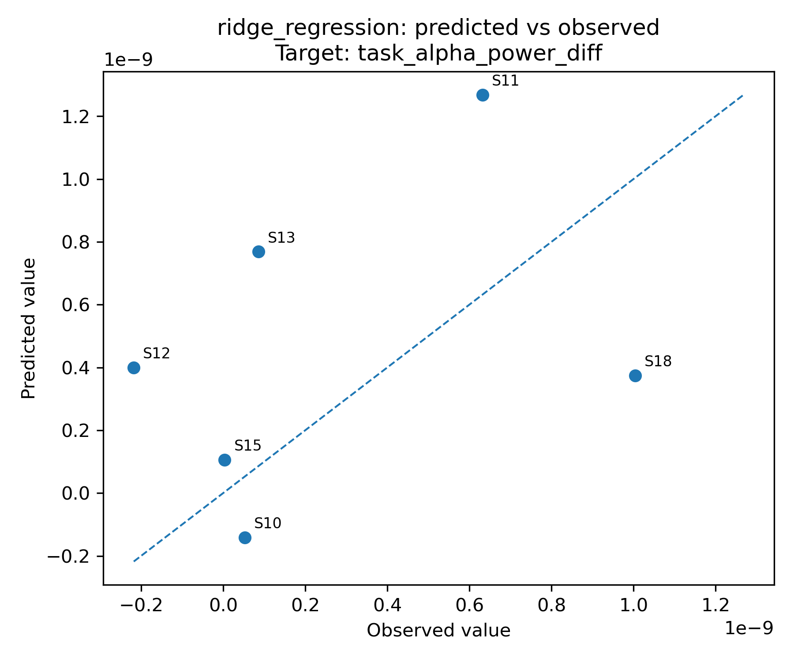

# MNE EEG Rest–Task Analysis Pipeline


A reproducible computational EEG workflow for resting-state and random-dot kinematogram (RDK) visual motion task data using **MNE-Python**, **specparam**, spectral feature extraction, aperiodic parameterization, exploratory statistics, and a basic machine-learning workflow demonstration.


---

## Project Snapshot

This repository demonstrates an end-to-end EEG analysis workflow:

- Resting-state EEG preprocessing and quality control
- RDK visual motion task event inspection and epoching
- Spectral band-power feature extraction
- Aperiodic EEG parameterization using `specparam`
- Posterior ROI-level rest–task feature integration
- Exploratory correlation analysis
- Basic leave-one-subject-out machine-learning workflow demonstration

Raw and processed EEG data are not publicly shared due to research-data ownership and participant confidentiality restrictions.

---

## Why This Project Matters

This project was designed to demonstrate reproducible computational neuroscience workflow construction rather than confirmatory statistical inference.

The pipeline shows how resting-state EEG features can be extracted, quality-controlled, integrated with task-related EEG modulation, and analyzed using transparent Python scripts. The emphasis is on responsible data handling, interpretable EEG features, and reproducible research organization.

---

## Research Aim

The main aim of this project is to examine whether resting-state EEG features are related to task-related EEG modulation during visual motion processing.

The central exploratory question is:

> Are resting-state spectral and aperiodic EEG features associated with coherent-versus-random RDK task EEG modulation?

---

## Visual Workflow

The project follows a structured rest–task EEG workflow:

```text
Resting EEG → preprocessing → QC → spectral/aperiodic features
Task EEG → event inspection → epoching → task spectral modulation
Rest features + task features → merged table → exploratory analysis → ML demo
```

The workflow emphasizes transparent preprocessing, responsible quality-control decisions, interpretable EEG feature extraction, and cautious exploratory analysis.

---

## Key Exploratory Results

After quality control, the final matched rest–task sample included six participants. Therefore, all statistical and machine-learning outputs are interpreted as exploratory and workflow-demonstration level rather than confirmatory evidence.

The strongest exploratory rest–task associations were observed between resting-state spectral features and task-related gamma-band modulation:

| Resting-State Feature | Task Outcome | Direction | Interpretation |
|---|---|---|---|
| Resting beta power | Task gamma modulation | Negative | Higher resting beta power was associated with lower coherent-minus-random gamma modulation. |
| Resting alpha power | Task gamma modulation | Negative | Higher resting alpha power was associated with lower task-related gamma modulation. |
| Resting aperiodic exponent | Task gamma modulation | Positive | Steeper resting aperiodic slopes showed a positive association with task gamma modulation. |

These patterns are treated as preliminary and hypothesis-generating. The main contribution of this repository is the reproducible EEG workflow rather than the statistical strength of the results.

---

## Example Outputs

The output figures are ordered to show the analysis story from pipeline design to exploratory modeling.

### 1. Pipeline Overview


### 2. Example Resting-State PSD



### 3. Rest–Task Correlation Heatmap



### 4. Example Exploratory Association



### 5. ML Demonstration Output



---

## Data Availability

Raw and processed EEG data are **not included** in this repository.

The EEG recordings belong to a supervised academic research project and may be subject to institutional data-sharing restrictions and participant confidentiality requirements.

This repository therefore focuses on the computational workflow, code organization, feature extraction strategy, quality-control decisions, and selected summary outputs.

---

## Repository Structure

```text
mne-eeg-rest-task-pipeline/
├── README.md
├── requirements.txt
├── .gitignore
│
├── scripts/
│   ├── 01_preprocess_resting.py
│   ├── 02_qc_resting.py
│   ├── 03_extract_resting_features.py
│   ├── 04_inspect_rdk_events.py
│   ├── 05_preprocess_rdk_task.py
│   ├── 06_extract_task_features.py
│   ├── 07_merge_rest_task.py
│   ├── 08_exploratory_analysis.py
│   ├── 09_ml_demo_loocv.py
│   └── 10_make_pipeline_overview.py
│
├── docs/
│   ├── project_summary.md
│   ├── methodology.md
│   ├── qc_decisions.md
│   └── interpretation_notes.md
│
├── results/
│   ├── tables/
│   └── figures/
│
└── figures/
    └── pipeline_overview.png
```

---

## Expected Local Data Structure

Raw and processed EEG data are **not included** in this repository. To reproduce the pipeline with authorized data access, organize files locally as:

```text
data/
├── raw/
│   ├── resting_state/
│   │   ├── S10/
│   │   ├── S11/
│   │   └── ...
│   │
│   └── task/
│       ├── S10/
│       ├── S11/
│       └── ...
│
└── processed/
    ├── resting_state/
    └── task/
```

The `data/` folder is excluded from GitHub using `.gitignore`.

---

## Software and Libraries

The pipeline uses:

- Python
- MNE-Python
- NumPy
- Pandas
- Matplotlib
- SciPy
- Scikit-learn
- specparam

Install dependencies with:

```bash
pip install -r requirements.txt
```

---

## Pipeline Components

| Step | Script | Purpose |
|---:|---|---|
| 01 | `01_preprocess_resting.py` | Preprocess resting-state EEG and create fixed-length epochs. |
| 02 | `02_qc_resting.py` | Summarize epoch retention and generate QC plots. |
| 03 | `03_extract_resting_features.py` | Extract band-power and aperiodic features using `specparam`. |
| 04 | `04_inspect_rdk_events.py` | Inspect RDK task trigger codes from the Status channel. |
| 05 | `05_preprocess_rdk_task.py` | Preprocess task EEG and epoch around RDK events. |
| 06 | `06_extract_task_features.py` | Extract condition-wise task spectral features and contrasts. |
| 07 | `07_merge_rest_task.py` | Merge resting and task features at subject level. |
| 08 | `08_exploratory_analysis.py` | Run exploratory correlations and generate plots. |
| 09 | `09_ml_demo_loocv.py` | Run a basic leave-one-subject-out ML demonstration. |
| 10 | `10_make_pipeline_overview.py` | Generate the pipeline overview figure. |

---

## RDK Task Event Codes

The RDK task event markers were inspected from the EEG Status channel.

| Event Code | Condition |
|---:|---|
| 10 | interval1_random |
| 18 | interval1_coherent |
| 30 | interval2_random |
| 38 | interval2_coherent |

The main task contrast was:

```text
coherent_minus_random
```

This contrast represents task-related spectral modulation between coherent and random motion conditions.

---

## Resting-State Features

Resting-state EEG features were extracted from posterior and global channel groups.

The main posterior ROI included:

```text
O1, O2, Oz, PO3, PO4, PO7, PO8
```

Extracted resting-state features included:

- Delta power
- Theta power
- Alpha power
- Beta power
- Gamma power
- Relative band power
- Aperiodic offset
- Aperiodic exponent
- Alpha peak frequency
- Alpha peak power
- Model fit quality metrics

Aperiodic EEG features were estimated using `specparam`.

---

## Rest–Task Integration

Resting-state EEG features were merged with RDK task EEG modulation features at the subject level.

Final matched sample:

```text
N = 6
```

Final included subjects:

```text
S10, S11, S12, S13, S15, S18
```

The final analysis table linked resting-state spectral/aperiodic features with RDK task coherent-minus-random spectral modulation.

---

## Machine-Learning Demonstration

A proof-of-concept machine-learning workflow was implemented using resting-state EEG features to predict RDK task-related spectral modulation.

Models used:

- Linear regression
- Ridge regression
- Random forest regression

Validation approach:

```text
leave-one-subject-out cross-validation
```

The machine-learning extension showed limited predictive performance, with mostly negative cross-validated R² values. This was expected given the final matched sample size.

The ML component is included to demonstrate:

- Feature-table construction
- Train/test workflow
- Leave-one-subject-out validation
- Regression-based prediction
- Model evaluation
- Coefficient inspection

It is not presented as a validated predictive model.

---

## Quality-Control Decisions

### Resting-State EEG

Resting-state EEG was preprocessed and segmented into 2-second epochs. Subject-level QC was based on the percentage of clean epochs retained after artifact rejection.

One participant was excluded from resting-state analysis due to insufficient clean epochs.

### RDK Task EEG

The following participants were excluded from task-level analysis due to insufficient clean epochs:

```text
S14, S17, S19, S20
```

The final matched rest–task sample included:

```text
S10, S11, S12, S13, S15, S18
```

Detailed quality-control notes are available in:

```text
docs/qc_decisions.md
```

---

## How to Run the Pipeline

After placing authorized EEG data locally in the expected structure, run:

```bash
python scripts/01_preprocess_resting.py
python scripts/02_qc_resting.py
python scripts/03_extract_resting_features.py
python scripts/04_inspect_rdk_events.py
python scripts/05_preprocess_rdk_task.py
python scripts/06_extract_task_features.py
python scripts/07_merge_rest_task.py
python scripts/08_exploratory_analysis.py
python scripts/09_ml_demo_loocv.py
```

To regenerate the pipeline overview figure:

```bash
python scripts/10_make_pipeline_overview.py
```

---

## Project Impact

This project demonstrates the ability to build a complete computational neuroscience workflow from raw EEG organization to interpretable feature-level analysis.

It highlights practical skills directly relevant to EEG research assistant roles, cognitive neuroscience labs, and computational neuroscience projects:

- Responsible EEG data handling
- Reproducible MNE-Python project structure
- Signal preprocessing and quality control
- Spectral and aperiodic feature engineering
- Rest–task feature integration
- Exploratory statistical analysis
- Basic machine-learning workflow implementation

---

## Skills Demonstrated

This project demonstrates:

- EEG preprocessing with MNE-Python
- Resting-state EEG analysis
- RDK task EEG analysis
- Event-code inspection and event-based epoching
- Spectral feature extraction
- Aperiodic EEG parameterization with `specparam`
- ROI-level EEG analysis
- Quality-control workflow
- Rest–task feature integration
- Exploratory statistical analysis
- Basic machine-learning workflow with scikit-learn
- Reproducible computational neuroscience project organization

---

## Limitations

This project is exploratory and pipeline-focused.

Main limitations:

1. Small final matched sample size.
2. Raw and processed EEG data are not included.
3. Task EEG quality varied across participants.
4. Machine-learning results are demonstration-level only.
5. Statistical findings should not be interpreted as confirmatory evidence.

---

## Disclaimer

This repository is intended as a computational neuroscience portfolio and methodological demonstration project. Due to data ownership, participant confidentiality restrictions, and the small final sample size, the repository emphasizes reproducible workflow design rather than confirmatory scientific inference.
